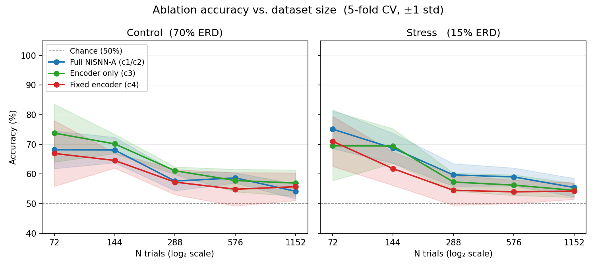

# Synthetic ERD Control Dataset for SNN Motor-Imagery Classification

Tests the hypothesis: *in NiSNN-A, class identity encoded only as mu/beta band-power modulation can be decoded by the spike encoder alone; the downstream spiking classifier layers do not contribute discriminative work.*

## Background

NiSNN-A (Zhang et al., [arXiv:2312.05643](https://arxiv.org/abs/2312.05643)) classifies motor-imagery EEG in two stages: a learnable spike encoder (Conv2d 1×5 + NiLIF) followed by a spiking classifier (Conv2d 10×10 + NiLIF). The dataset here isolates one question: where does the discrimination actually happen?

See [post.md](post.md) for the full write-up including ERD physiology, dataset design rationale, and ablation mapping.

## Repository layout

```
data/
  control/         # 288 trials, 70% ERD modulation: clear signal
  stress/          # 288 trials, 15% ERD modulation: weak signal
  control_N<n>/    # sweep datasets at trial counts 72/144/288/576/1152
  stress_N<n>/
figures/
  fig_a_traces.png
  fig_b_spectrogram.png
  fig_c_bandpower.png
  fig_sweep.png    # accuracy vs. dataset size (generated by plot_sweep.py)
src/
  generate.py      # synthetic ERD dataset generator
  make_figures.py  # produces figures a–c
  nilif.py         # Non-iterative LIF neuron (NiSNN-A, Zhang et al.)
  model.py         # Full NiSNN-A + EncoderOnly + FixedEncoder ablation variants
  train.py         # 5-fold cross-validation experiment runner
  sweep.py         # dataset-size sweep across N=[72,144,288,576,1152]
  plot_sweep.py    # plots sweep results as fig_sweep.png
post.md            # full project write-up
REPRODUCE.md       # step-by-step reproduction instructions
requirements.txt
results.json       # ablation results at N=288 (generated by train.py)
sweep_results.json # size-sweep results (generated by sweep.py)
```

## Quick start

```bash
python3 -m venv .venv
.venv/bin/pip install -r requirements.txt
.venv/bin/python src/train.py        # run all ablation experiments (N=288)
```

To run the dataset-size sweep:
```bash
.venv/bin/python src/sweep.py                              # full sweep: N=[72,144,288,576,1152]
.venv/bin/python src/sweep.py --sizes 72 288 --variants full --epochs 20   # quick test
.venv/bin/python src/plot_sweep.py                         # generate figures/fig_sweep.png
```

Full reproduction instructions (dataset generation, figures, experiments) are in [REPRODUCE.md](REPRODUCE.md).

## Experiments and results

### Ablation at N=288

Four ablation conditions on control (70% ERD) and stress (15% ERD) datasets, 5-fold CV:

| Experiment | Model | Control acc | Stress acc |
|-----------|-------|------------|-----------|
| c1/c2 | Full NiSNN-A | **64.2% ± 2.8%** | 63.2% ± 2.8% |
| c3 | EncoderOnly (no classifier) | **63.2% ± 2.2%** | 61.5% ± 1.4% |
| c4 | FixedEncoder (sign threshold) | 57.3% ± 4.2% | 54.5% ± 5.0% |
| - | Chance baseline | 50% | 50% |

**c3 result**: encoder-only matches the full model within 1pp on both datasets. The spiking classifier layers add nothing; the spike encoder captures all discriminative information. This supports the hypothesis.

**c4 result**: replacing the learned encoder with a fixed sign threshold drops accuracy by 7pp, confirming the *learned* encoder contributes, but the gap is modest.

**Accuracy ceiling (64%)**: lower than the 85–95% achievable with band-power features (logistic regression: 100%). The bottleneck is the encoder's 1×5 kernel, which spans ~37.5 ms, shorter than one mu-band cycle (77–125 ms). The NiLIF's temporal integration partially compensates but cannot fully resolve sub-Nyquist mu oscillations.

### Dataset-size sweep (N = 72 → 1152)



The sweep runs all three model variants across five dataset sizes on both signal conditions, 5-fold CV. Summary (mean ± std, 5-fold CV):

| Model | Dataset | N=72 | N=144 | N=288 | N=576 | N=1152 |
|-------|---------|------|-------|-------|-------|--------|
| Full NiSNN-A | control | 68.2% ± 6.4% | 68.1% ± 4.3% | 57.6% ± 3.2% | 58.7% ± 1.8% | 54.2% ± 2.5% |
| Full NiSNN-A | stress | 75.1% ± 6.5% | 68.7% ± 5.1% | 59.7% ± 3.8% | 59.0% ± 3.0% | 55.5% ± 3.1% |
| EncoderOnly | control | 73.8% ± 9.8% | 70.2% ± 3.3% | 61.1% ± 1.3% | 57.8% ± 3.8% | 57.0% ± 4.4% |
| EncoderOnly | stress | 69.5% ± 11.7% | 69.5% ± 5.9% | 57.3% ± 3.0% | 56.3% ± 3.5% | 54.5% ± 2.4% |
| FixedEncoder | control | 67.0% ± 11.1% | 64.6% ± 2.6% | 57.3% ± 4.2% | 54.9% ± 5.6% | 55.7% ± 4.7% |
| FixedEncoder | stress | 71.0% ± 8.4% | 61.8% ± 5.6% | 54.5% ± 5.0% | 54.0% ± 4.0% | 54.3% ± 2.8% |

**Accuracy vs. N**: apparent accuracy is highest at small N (72–144 trials) but comes with high fold variance (±6–12%), driven by tiny test sets (~15 trials per fold). As N grows the estimate stabilises: all models converge toward 54–60% by N=576–1152. The declining mean with N is a variance artefact of the small-N regime, not a genuine capacity effect.

**Hypothesis holds at every scale**: encoder-only matches or marginally exceeds full NiSNN-A at all five dataset sizes (within noise). The spiking classifier layers contribute nothing regardless of how much training data is available.

**Fixed encoder degrades more at small N**: the gap between fixed-encoder and the other two is largest at N=72–144 (where the learned encoder's advantage over a sign threshold is most visible) and narrows to near-zero at N≥576.

## Implementation notes

Two deviations from the NiSNN-A paper were required to achieve stable training:

1. **BatchNorm before each NiLIF**: without it, leaky accumulation drives membrane potentials far above the surrogate-gradient window and gradients vanish.
2. **Straight-through estimator for the inner spike**: the paper's two-surrogate formulation compounds gradient sparsity (~5% of neurons active); replacing the inner surrogate with STE recovers gradient flow.
