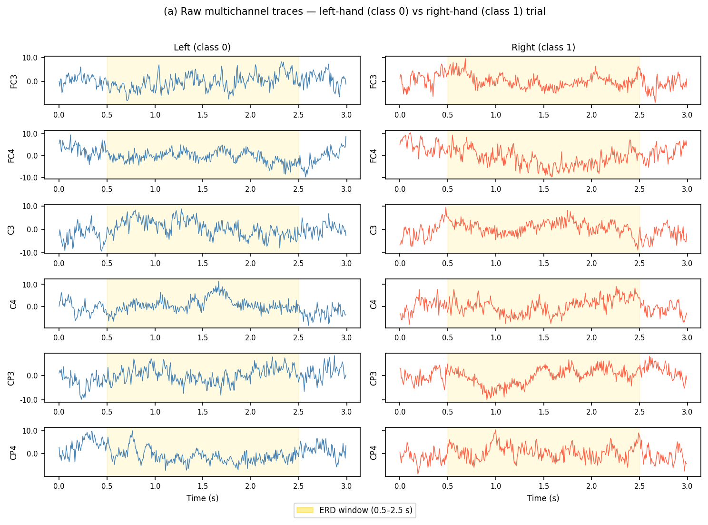
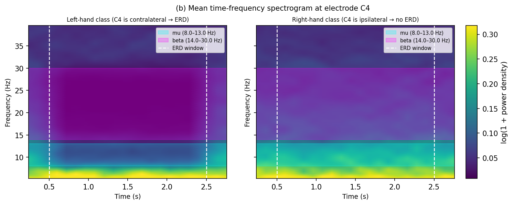
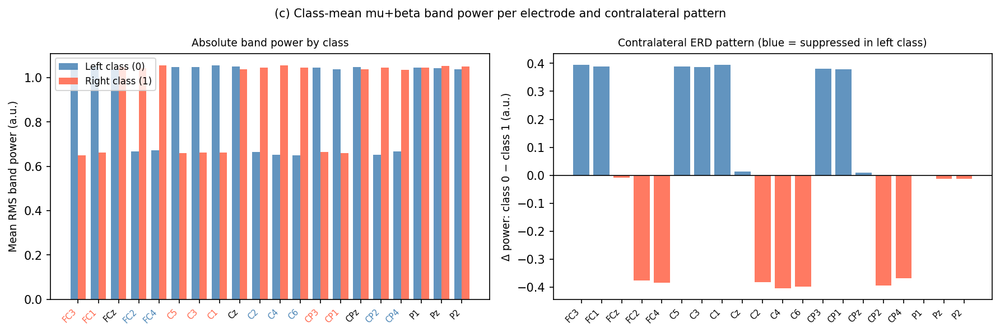

# A Synthetic ERD Dataset for Isolating the Spike Encoder in SNN-Based Motor-Imagery Classification

## Motivation

Spiking Neural Networks (SNNs) classify motor-imagery EEG by processing data through two distinct stages: a **learnable spike encoder** that converts real-valued EEG samples into binary spike trains, followed by **spiking classifier layers** that integrate those spikes to produce a class label. The NiSNN-A model of Zhang et al. ([arXiv:2312.05643](https://arxiv.org/abs/2312.05643)) is a recent representative: its first Conv2d layer (kernel 1×5) acts as the spike encoder, its second Conv2d layer (kernel 10×10) acts as the classifier, and its Non-iterative LIF (NiLIF) neurons replace the standard iterative LIF to avoid vanishing gradients over long time sequences.

A standing question in this design is: **where does the discriminative work actually happen?** If the spike encoder already captures the class-relevant structure in its output spike trains, the downstream spiking layers add little more than a linear readout. If, on the other hand, the spiking layers are essential, disabling them should collapse accuracy. A real EEG benchmark cannot cleanly answer this because real EEG contains many confounders (session noise, artefacts, subject variability) that make it impossible to attribute an accuracy drop to a single architectural component. A controlled synthetic dataset removes those confounders.

The hypothesis under test is: **a synthetic signal that encodes class identity only as mu/beta band-power modulation (an ERD analogue) can be decoded by the learnable spike encoder alone.** This page describes the dataset built to enable that test.

---

## Background: ERD as the signal of interest

Motor imagery induces **event-related desynchronisation (ERD)**: a reduction in EEG power in the mu rhythm (8–13 Hz) and beta band (14–30 Hz) over the motor cortex contralateral to the imagined hand movement (Tayeb et al., 2017). For left-hand imagery, power drops in right-hemisphere electrodes (C4, CP4, FC4, …); for right-hand imagery, power drops in left-hemisphere electrodes (C3, CP3, FC3, …). This contralateral, band-specific pattern is the primary information source in motor-imagery BCIs.

The dataset plants exactly this structure and nothing else. The base signal per channel is 1/f (pink) noise, which carries no class information. Class identity is encoded by suppressing mu and beta power in the appropriate hemisphere during a fixed time window, matching the contralateral ERD pattern described above.

---

## Dataset description

Each trial is a tensor of shape **(C=20, S=20, T=20)**, matching the NiSNN-A input interface for the BCIC IV 2a dataset (Zhang et al., Table I). The axes are:

| Axis | Size | Meaning |
|------|------|---------|
| C | 20 | EEG channels (same electrode set as BCIC IV 2a) |
| S | 20 | Timepieces: coarse temporal segments |
| T | 20 | Time steps within each timepiece |

The flat time dimension D = S × T = 400 samples at an effective sampling rate of ~133 Hz (400 steps per 3-second trial, matching the NiSNN-A downsampling from 250 Hz).

Two classes balance at 144 trials each (288 total per variant):

- **Class 0 (left-hand analogue):** mu+beta power suppressed in right-hemisphere channels FC4, FC2, C6, C4, C2, CP4, CP2 during 0.5–2.5 s.
- **Class 1 (right-hand analogue):** mu+beta power suppressed in left-hemisphere channels FC3, FC1, C5, C3, C1, CP3, CP1 during 0.5–2.5 s.

All 20 channels use the same electrode names as the BCIC IV 2a subset in NiSNN-A (FC-3/1/z/2/4, C-5/3/1/z/2/4/6, CP-3/1/z/2/4, P-1/z/2).

### Variants

Two dataset variants are provided to support the ablation experiments described below:

| Variant | Modulation depth | Noise level | Signal-to-noise |
|---------|-----------------|-------------|-----------------|
| **control** | 70% suppression | 1× | clear; a baseline should decode well |
| **stress** | 15% suppression | 3× | weak; tests robustness near chance |

---

## Example figures

### Figure (a): Raw multichannel traces



**Figure (a).** Raw amplitude traces (arbitrary units) for six electrode pairs (left/right hemisphere, frontal–central–parietal rows) for one left-class trial (blue) and one right-class trial (red). The gold band marks the ERD modulation window (0.5–2.5 s). The contralateral suppression is not visible by eye in the raw signal (it lives in the mu/beta frequency bands), confirming that band-power analysis (Figures b and c) is required to reveal the class structure.

---

### Figure (b): Time-frequency spectrogram



**Figure (b).** Mean log-power spectrogram at electrode C4, averaged over all 144 left-class trials (left panel) and all 144 right-class trials (right panel). The frequency axis is clipped to 5–40 Hz to prevent the dominant 1/f low-frequency power from compressing the colour scale. Cyan and magenta bands mark the mu (8–13 Hz) and beta (14–30 Hz) ranges; dashed white lines bound the 0.5–2.5 s ERD window. C4 sits in the contralateral hemisphere for left-hand imagery: the left-class panel shows clear power suppression in both bands during the window (dark region), while the right-class panel shows no such suppression, confirming that the planted ERD is visible in the time-frequency domain.

---

### Figure (c): Class-mean band-power per channel



**Figure (c).** Left panel: mean mu+beta RMS band power per electrode for the left-class (blue) and right-class (red) trials. Right panel: difference (class 0 − class 1); blue bars mark electrodes suppressed in the left-class trial (right hemisphere), red bars mark electrodes suppressed in the right-class trial (left hemisphere). The pattern mirrors contralateral ERD in real motor-imagery EEG: the hemisphere opposite to the imagined hand shows the greatest power reduction, while the ipsilateral hemisphere is unaffected. This confirms the dataset encodes class identity solely and precisely as a lateralised band-power modulation.

---

## Generation procedure

The generator ([`src/generate.py`](src/generate.py)) follows four steps per trial:

1. **Base signal.** Each channel gets an independent 1/f (pink) noise signal of length D=400, scaled by `noise_level`. Pink noise is chosen because real EEG has a 1/f power spectrum, so the background statistics are physically plausible.

2. **Band isolation.** For channels in the class-appropriate modulated subset, the mu (8–13 Hz) and beta (14–30 Hz) components of the base signal are extracted with a 4th-order Butterworth bandpass filter (zero-phase via `sosfiltfilt`).

3. **ERD injection.** Within the modulation window (samples 67–333 at ~133 Hz), the mu and beta components are suppressed by `modulation_depth` (fraction of amplitude removed). The remaining signal retains all other frequency content unchanged.

4. **Reshaping.** The flat D=400 signal is reshaped to (S=20, T=20) for storage.

All other channels receive unmodified pink noise.

### Parameter table

| Parameter | Control | Stress | Description |
|-----------|---------|--------|-------------|
| `n_trials` | 288 | 288 | trials per dataset |
| `n_channels` | 20 | 20 | electrode count |
| `fs` | ~133.3 Hz | ~133.3 Hz | effective sampling rate (400 samples / 3 s) |
| `S` | 20 | 20 | timepieces per trial |
| `T` | 20 | 20 | steps per timepiece |
| `mu_band` | 8–13 Hz | 8–13 Hz | mu rhythm edges |
| `beta_band` | 14–30 Hz | 14–30 Hz | beta band edges |
| `mod_window` | 0.5–2.5 s | 0.5–2.5 s | ERD active window |
| `modulation_depth` | **0.70** | **0.15** | fraction of band amplitude suppressed |
| `noise_level` | **1.0** | **3.0** | base noise amplitude scale |
| `seed` | 42 | 42 | random seed for reproducibility |

The config is saved alongside each dataset as `*_config.json` for full reproducibility.

---

## Mapping to ablation experiments c1–c4

The dataset enables four controlled experiments:

| Experiment | Question | How the dataset supports it |
|------------|----------|----------------------------|
| **c1** | Is the toy dataset a fair MI-decoding regime? | The control variant plants a clear contralateral ERD pattern (Figure c shows ~37% band-power drop in the modulated channels). If the full NiSNN-A model does not exceed chance on this variant, the dataset is too hard, not the model. The stress variant sets the lower bound where any model should struggle. |
| **c2** | What is the full-model accuracy ceiling? | Run NiSNN-A as published on the control variant. This is the reference accuracy all ablations are measured against. |
| **c3** | Do the spiking classifier layers contribute? | Replace the second Conv2d+NiLIF block with a fixed random projection or remove it entirely, then re-evaluate on the control variant. If accuracy is preserved, the class information was fully captured by the spike encoder; if accuracy drops, the classifier layers were necessary. **Interpretive caveat:** NiSNN-A's encoder kernel spans 5 steps ≈ 37.5 ms, which is shorter than one full mu cycle (77–125 ms). If the encoder-only ablation fails, it is necessary to test whether a longer-kernel encoder variant also fails before concluding that the classifier layers are architecturally essential; a too-short kernel would confound the result. |
| **c4** | How much does the learnable encoder matter? | Swap the learned spike encoder (first Conv2d+NiLIF, kernel 1×5) for a fixed threshold encoder (e.g. simple rate coding). If accuracy drops significantly, the learnable encoder was doing the discriminative work; if it does not, fixed encoding suffices for this ERD-only signal. |

The dataset is designed so that **the only discriminative signal is band-power lateralisation**, precisely what the spike encoder should detect if the hypothesis holds. Experiments c3 and c4 can therefore produce a clean, causally interpretable answer.

---

## Data and code

- **Generator:** [`src/generate.py`](src/generate.py)
- **Figure generator:** [`src/make_figures.py`](src/make_figures.py)
- **Control dataset:** [`data/control/`](data/control/): `control_trials.npy` (288×20×20×20, float32), `control_labels.npy`, `control_config.json`
- **Stress dataset:** [`data/stress/`](data/stress/): same structure, weak modulation

Reproduce from scratch:
```bash
python3 -m venv .venv && .venv/bin/pip install numpy scipy matplotlib
.venv/bin/python src/generate.py --variant control
.venv/bin/python src/generate.py --variant stress
.venv/bin/python src/make_figures.py
```

The code that supports data generation and experiments is available [here](https://github.com/pepijn-lens/eeg-spiking-nets).